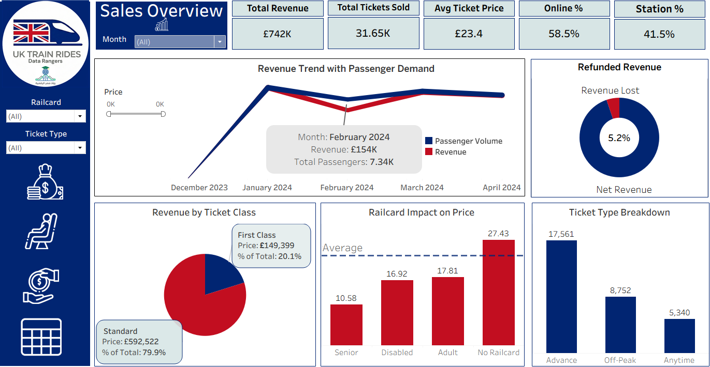
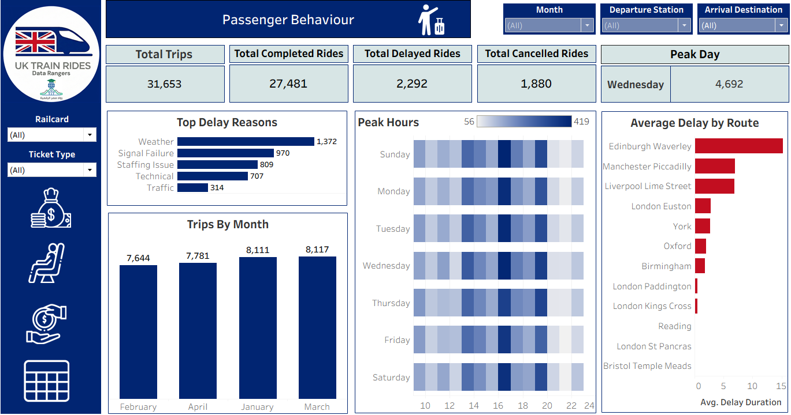
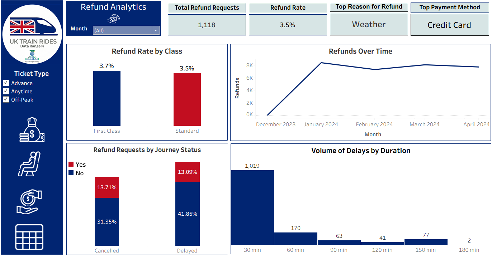

# Graduation Project — UK Train Rides Data Analysis

This project analyzes UK train ride data to understand travel patterns, identify potential operational issues, and provide data-driven recommendations. The work centers on data cleaning, exploratory analysis, visualization, and reporting, with dashboards to highlight key KPIs.

## Table of Contents
- [Project Summary](#project-summary)
- [Objectives](#objectives)
- [Scope](#scope)
  - [Included](#included)
  - [Excluded](#excluded)
- [Repository Structure](#repository-structure)
- [Data](#data)
- [Notebooks](#notebooks)
- [Dashboards](#dashboards)
- [SQL](#sql)
- [Reports](#reports)
- [Environment & Setup](#environment--setup)
- [Usage](#usage)
- [Project Timeline (Gantt)](#project-timeline-gantt)

## Project Summary
The goal of this project is to analyze UK train ride data to understand travel patterns, identify potential issues, and provide data-driven recommendations. The project uses data cleaning, exploratory analysis, visualization, and reporting to surface insights for improved service quality and network efficiency.

## Objectives
- Collect and clean train ride data to ensure accuracy.
- Analyze travel trends (peak days, high-demand routes, delays).
- Build dashboards to visualize key findings.
- Define KPIs to measure service quality.
- Provide actionable recommendations to improve network efficiency.

## Scope

### Included
- Analysis of ride data, pricing, delays, and customer bookings.
- Creation of dashboards and visual reports.
- Recommendations based on data insights.

### Excluded
- Development of a new booking system.
- Real-time data streaming or live updates.
- Integration with external railway systems.

## Repository Structure
- [README.md](./README.md): Project documentation.
- [requirements.txt](./requirements.txt): Python dependencies for notebooks and analysis tooling.
- [data/](./data): Raw and processed datasets 
- [notebooks/](./notebooks): Jupyter notebooks for cleaning, EDA, feature engineering, modeling, and visualization.
- [SQL/](./SQL): SQL scripts for data exploration, extraction, and aggregation. In addition to the backup file for the database.
- [dashboard/](./dashboard): Dashboard assets or exports 
- [reports/](./reports): Analytical reports and findings

## Data
- `data/raw/`: Original source files.
- `data/processed/`: Cleaned and transformed outputs for analysis.

## Notebooks
The `notebooks/` directory is the core of this repository (primary language: Jupyter Notebook):
- `CleanedUKRailways.ipynb`
- `forecasting.ipynb`

## Dashboards
- Sales Dashboard

- Passengers Dashboard

- Refunds Dashboard

- Operational Logic Dashboard

## SQL
- Data extraction from source systems or staging tables.
- Aggregations for KPIs.
- Reproducible transformations that align with notebook outputs.

## Reports
- Executive summaries of key findings.
- Methodology and assumptions.
- KPI definitions and baseline comparisons.
- Recommendations for operations and customer experience.

## Environment & Setup
This repo uses Python and Jupyter Notebooks. To set up a local environment:

1. Ensure Python 3.9+ is installed.
2. Create and activate a virtual environment:
   - `python -m venv .venv`
   - Windows: `.venv\Scripts\activate`
   - macOS/Linux: `source .venv/bin/activate`
3. Install dependencies:
   - `pip install -r requirements.txt`

Note: If `requirements.txt` is currently minimal or empty, consider adding commonly used packages:
- `pandas`, `numpy`, `matplotlib`, `seaborn`, `scikit-learn`, `jupyter`, `sqlalchemy`

## Usage
- Launch Jupyter:
  - `jupyter notebook` or `jupyter lab`
- Open notebooks in [notebooks/](./notebooks) and run cells sequentially.
- Ensure paths to data files are correct in each notebook.
- Export figures and processed data for dashboards and reports.

## Project Timeline (Gantt)
You can review the project schedule and progress in the Gantt chart using the link below:
- [Project Gantt (Google Sheets)](https://docs.google.com/spreadsheets/d/1ZY-YIEKkhtWHg1emUjwdrg8tCzkws9FGL4L02y9hS6o/edit?gid=1115838130#gid=1115838130)

